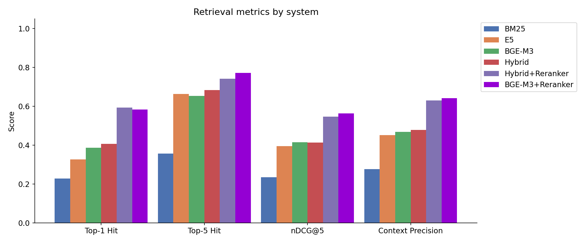
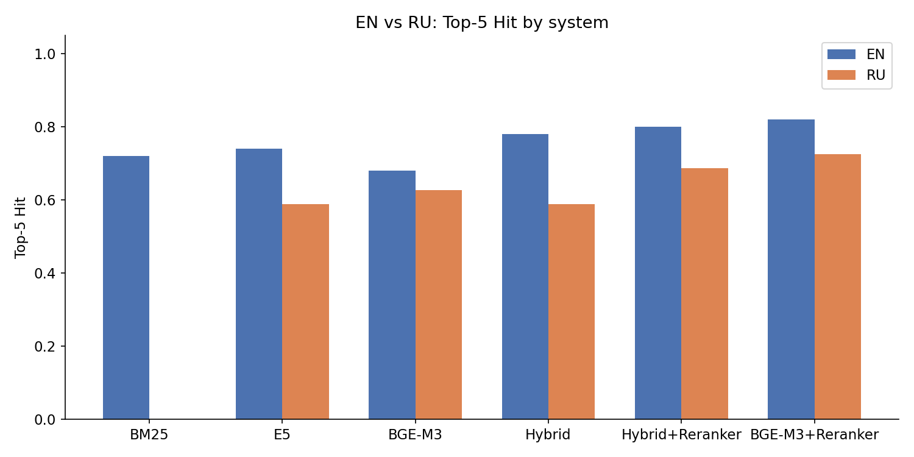
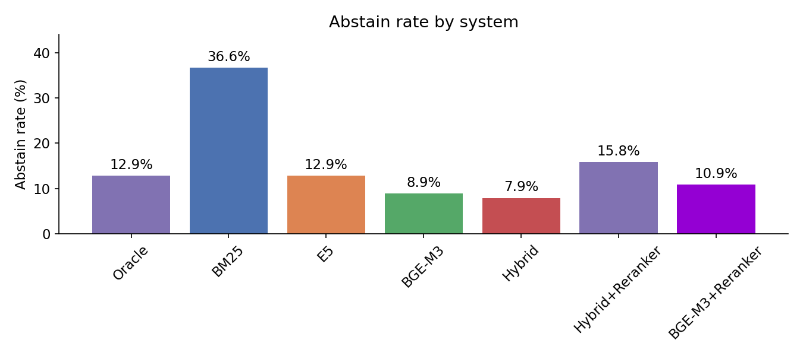
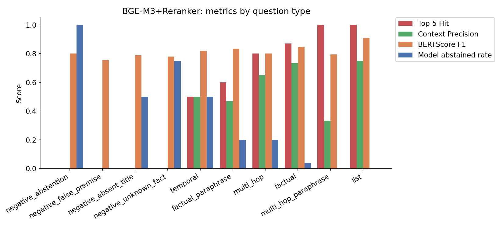

# RAG-система для аниме-вики

RAG (Retrieval-Augmented Generation) для вопросов и ответов по аниме-вики: Hunter x Hunter, Naruto, Sword Art Online. Запросы на английском и русском. Сравниваются шесть стратегий поиска.

---

## Примеры

**Фактический вопрос (EN)**
```
Q:  What is the name of Meleoron's third ability, which allows another person to share Perfect Plan?
A:  God's Accomplice
```

**Фактический вопрос (RU)**
```
Q:  По какому адресу Kiriko направил Гона, Курапику и Леорио в Забан-Сити?
A:  2-5-10 Tsubashi Street
```

**Multi-hop (RU) — ответ требует объединения нескольких чанков**
```
Q:  Какой 27-ударной техникой Dual Blades Kirito случайно атаковал создателя этой системы умений?
A:  The Eclipse
```

**Отказ от ответа (EN) — информации нет в базе**
```
Q:  Who is the captain of Squad 1 in the Gotei 13?
A:  Not in the provided context
```

---

## Архитектура

```
XML-дамп вики (fandom)
        |
        v
  prepare_data.py       (mwparserfromhell, regex)
        |
        v
  TextSplitter.py       (tiktoken, 500 токенов, overlap 50)
        |
        +----------------------------+
        |                            |
        v                            v
  Плотные эмбеддинги           BM25-индекс
  (BGE-M3 / mE5)          (лемматизация EN+RU)
  FAISS IndexFlatIP
        |                            |
        +-------------+--------------+
                      |
                   Ретривер
            +--------+--------+
          FAISS     BM25    Hybrid (RRF)
                               |
                     BGE-Reranker-Base (опц.)
                               |
                               v
               Llama-3.3-70B (Groq / локальная модель)
                               |
                               v
                             Ответ
```

### Компоненты

| Компонент | Выбор | Зачем |
|---|---|---|
| Разбивка текста | 500 токенов, overlap 50 | Нет разрывов внутри предложений |
| Плотный энкодер | BAAI/bge-m3 | Мультиязычный, работает на EN и RU |
| Разреженный энкодер | BM25 + pymorphy3 / NLTK | Лемматизация под язык запроса |
| Слияние | Reciprocal Rank Fusion (k=60) | Без ручной настройки параметров |
| Реранкер | BAAI/bge-reranker-base | Кросс-энкодер уточняет порядок топ-K |
| LLM | llama-3.3-70b-versatile (Groq) | T=0, детерминированный вывод |
| Языковая привязка | Правило в промпте + few-shot | Язык ответа = язык вопроса |

---

## Данные

| Фандом | Страниц |
|---|---|
| Hunter x Hunter | ~1 982 |
| Naruto | ~7 655 |
| Sword Art Online | ~1 102 |
| Итого | ~10 739 (единый FAISS-индекс) |

---

## Оценка

### Тестовая выборка

101 вопрос (50 EN / 51 RU), 9 типов:

| Тип | Описание |
|---|---|
| factual | Прямой фактический вопрос |
| factual_paraphrase | Перефразированный вариант factual |
| multi_hop | Нужно объединить факты из 2+ чанков |
| multi_hop_paraphrase | Перефразированный multi_hop |
| list | Ожидается перечисление |
| temporal | Временные факты |
| negative_abstention | Ответа нет ни в одной вики |
| negative_false_premise | Ложное допущение в вопросе |
| negative_absent_title | Сущность есть, ответа нет |
| negative_unknown_fact | Факт отсутствует в источнике |

### Метрики ретривера

Hit@K = 1, если хотя бы один релевантный чанк попал в топ-K. Лучшее значение в столбце выделено зелёным.

| Система | Recall@5 EN | Recall@5 RU | Hit@1 EN | Hit@1 RU | Hit@5 EN | Hit@5 RU | nDCG@5 EN | nDCG@5 RU | Ctx Prec EN | Ctx Prec RU |
|---|---|---|---|---|---|---|---|---|---|---|
| BM25 | 0.492 | 0.000 | 0.460 | 0.000 | 0.720 | 0.000 | 0.475 | 0.000 | 0.558 | 0.000 |
| E5 (mE5-base) | 0.500 | 0.409 | 0.380 | 0.275 | 0.740 | 0.588 | 0.444 | 0.349 | 0.509 | 0.396 |
| BGE-M3 | 0.463 | 0.438 | 0.400 | 0.373 | 0.680 | 0.627 | 0.422 | 0.409 | 0.484 | 0.453 |
| Hybrid (BGE+BM25) | 0.528 | 0.386 | 0.440 | 0.373 | 0.780 | 0.588 | 0.486 | 0.344 | 0.561 | 0.397 |
| Hybrid + Reranker | 0.570 | 0.518 | $\color{green}{\text{0.700}}$ | 0.490 | 0.800 | 0.686 | $\color{green}{\text{0.598}}$ | 0.497 | $\color{green}{\text{0.707}}$ | 0.554 |
| BGE-M3 + Reranker | $\color{green}{\text{0.592}}$ | $\color{green}{\text{0.543}}$ | 0.640 | $\color{green}{\text{0.529}}$ | $\color{green}{\text{0.820}}$ | $\color{green}{\text{0.725}}$ | $\color{green}{\text{0.598}}$ | $\color{green}{\text{0.530}}$ | 0.688 | $\color{green}{\text{0.596}}$ |

BM25 даёт нули на русском: индекс хранит английские токены, кириллические запросы не находят совпадений.

### Метрики генерации

Abstain Rate - доля вопросов, на которые модель отказалась отвечать. Чем ниже - тем лучше (кроме типа negative, где отказ правильный).

| Система | BERTScore F1 EN | BERTScore F1 RU | Abstain Rate EN | Abstain Rate RU |
|---|---|---|---|---|
| Oracle (верхняя граница) | 0.847 | 0.847 | 0.100 | 0.157 |
| BM25 | 0.841 | 0.824 | 0.140 | 0.588 |
| E5 (mE5-base) | 0.843 | 0.838 | 0.140 | 0.118 |
| BGE-M3 | 0.830 | 0.833 | 0.100 | $\color{green}{\text{0.078}}$ |
| Hybrid (BGE+BM25) | $\color{green}{\text{0.845}}$ | $\color{green}{\text{0.840}}$ | $\color{green}{\text{0.060}}$ | 0.098 |
| Hybrid + Reranker | 0.836 | 0.837 | 0.160 | 0.157 |
| BGE-M3 + Reranker | 0.836 | 0.840 | 0.120 | 0.098 |

BERTScore считался через `bert-base-multilingual-cased`.

### RAGAs: Oracle vs BGE-M3+Reranker (EN)

| Система | Faithfulness | Answer Correctness | Answer Relevancy |
|---|---|---|---|
| Oracle | 0.745 | $\color{green}{\text{0.503}}$ | $\color{green}{\text{0.261}}$ |
| BGE-M3 + Reranker | $\color{green}{\text{0.747}}$ | 0.477 | 0.173 |

### Latency (Groq API, llama-3.3-70b-versatile)

Замеры по финальным прогонам пайплайна. Retrieval time - отдельный бенчмарк по колонкам из CSV.

**Время поиска (retrieval only):**

| Ретривер | Среднее |
|---|---|
| FAISS (BGE-M3) | 8 мс |
| FAISS (E5) | 6 мс |
| BM25 | 1720 мс |

BM25 медленнее FAISS в ~200 раз: при каждом запросе скорирует весь корпус (~28k чанков).

**E2E latency по системам (median / p95):**

| Система | LLM gen median | LLM gen p95 | E2E median | E2E p95 | Overhead (retrieval+rerank) |
|---|---|---|---|---|---|
| BM25 | 6.9 с | 11.0 с | 8.9 с | 13.0 с | ~2.0 с |
| E5 | 6.7 с | 19.0 с | 6.7 с | 19.0 с | ~0.02 с |
| BGE-M3 | 7.5 с | 32.6 с | 7.5 с | 32.6 с | ~0.04 с |
| Hybrid (BGE+BM25) | 6.5 с | 21.7 с | 8.8 с | 24.0 с | ~2.1 с |
| Hybrid + Reranker | 7.4 с | 19.2 с | 10.1 с | 22.1 с | ~2.7 с |
| BGE-M3 + Reranker | 7.3 с | 25.7 с | 8.0 с | 26.4 с | ~0.65 с |

Основной источник задержки - LLM (Groq API). Реранкер добавляет 0.65 с к BGE-M3 и ~0.6 с к Hybrid. Высокий p95 у BGE-M3 объясняется rate limiting Groq при длинных прогонах.

---

## Графики

| | |
|---|---|
|  |  |
| Метрики ретривера по системам | EN vs RU: Top-5 Hit |
|  |  |
| Abstain Rate по системам | BGE-M3+Reranker по типам вопросов |

---

## Выводы

1. **BM25 не работает на русском.** Нулевые метрики поиска, abstain rate 58.8% на RU. Нужен мультиязычный энкодер для работы на двух языках.

2. **Реранкер - самый большой прирост качества.** nDCG@5 и Context Precision растут на 30-40% без изменения индекса.

3. **BGE-M3+Reranker - лучший ретривер.** Лидирует по всем метрикам на EN и RU.

4. **Hybrid без реранкера - лучший баланс.** Hit@5 EN 0.78, RU 0.59, минимальный abstain rate (6% EN).

5. **BERTScore почти не зависит от ретривера.** Разброс всего 0.830-0.847 у всех систем - вплотную к Oracle.

6. **Faithfulness BGE-M3+Reranker (0.747) = Oracle (0.745).** Модель не галлюцинирует относительно контекста даже при несовершенном поиске.

---

## Структура проекта

```
.
|-- prepare_data.py                   # Wiki XML -> JSONL
|-- TextSplitter.py                   # Разбивка текста (tiktoken)
|-- create_knowledge_database.py      # Эмбеддинги, FAISS, BM25, реранкер
|-- implement_LLM.py                  # Пайплайн: поиск + генерация
|
|-- parsed_pages/                     # JSONL-страницы по фандомам
|-- chunks/                           # Чанки (.npy) + общий pickle
|-- faiss_index/                      # FAISS-индексы
|-- bm3/faiss/                        # FAISS для BGE-M3
|
|-- data_with_llm_answers_final/      # CSV с метриками по системам
|-- eval_set_v3_clean_sampled.jsonl   # Тестовая выборка (101 вопрос)
|
|-- chart1_system_comparison.png
|-- chart2_en_ru.png
|-- chart3_abstain_rate.png
|-- chart4_question_types.png
|-- f.ipynb
```

---

## Установка

```bash
pip install sentence-transformers faiss-cpu rank-bm25 groq \
            mwparserfromhell tiktoken langdetect pymorphy3 \
            nltk python-dotenv pandas numpy tqdm transformers
```

```python
import nltk
nltk.download('wordnet')
nltk.download('stopwords')
```

Файл `.env`:

```
GROQ_API_KEY=your_key_here
```

---

## Использование

### FastAPI

Запуск сервера:

```bash
uvicorn app:app --reload
```

Эндпоинт `POST /generate`:

```bash
curl -X POST http://localhost:8000/generate \
     -H "Content-Type: application/json" \
     -d '{"query": "Who taught Gon how to use Nen?", "top_k": 5}'
```

```json
{"answer": "Wing"}
```

Все параметры запроса:

| Поле | Тип | По умолчанию | Описание |
|---|---|---|---|
| query | str | - | Вопрос (EN или RU) |
| top_k | int | 5 | Количество чанков для контекста |
| temperature | float | 0.3 | Температура генерации |
| max_tokens | int | 512 | Максимум токенов в ответе |
| threshold | float | 20.0 | Минимальный FAISS-скор для чанка |

Документация доступна на `http://localhost:8000/docs` (Swagger UI).

### Разбор XML-дампов

```python
from prepare_data import load_wiki_fandom

load_wiki_fandom(
    'hunterxhunter.fandom.com-20260413-wikidump/hunterxhunter.fandom.com-20260413-current.xml',
    'parsed_pages/hunter_parsed_pages.jsonl'
)
```

### Построение индекса

```python
from create_knowledge_database import (
    create_embed, build_index, merge_all_faiss_index, merge_all_chunks
)

create_embed(
    'parsed_pages/hunter_parsed_pages.jsonl',
    'chunks/hunter_chunks.npy',
    'chunks/hunter_embedding_chunks.npy',
    source='hunter',
    retriever_model='bge-m3'
)

build_index('chunks/hunter_embedding_chunks.npy', 'faiss_index/hunter.faiss')

merge_all_faiss_index(
    ['faiss_index/hunter.faiss', 'faiss_index/naruto.faiss', 'faiss_index/sao.faiss'],
    is_save=True, path_to_save='faiss_index/all_fandom.faiss'
)
merge_all_chunks(
    ['chunks/hunter_chunks.npy', 'chunks/naruto_chunks.npy', 'chunks/sao_chunks.npy'],
    is_save=True, path_to_save='chunks/all_fandom_chunks.pkl'
)
```

### Запрос

```python
from implement_LLM import generate_response, load_chunks

faiss_index, all_chunks = load_chunks()

# BGE-M3 + реранкер
answer, chunks = generate_response(
    query='Who taught Gon how to use Nen?',
    top_k=5,
    faiss_index=faiss_index,
    all_chunks=all_chunks,
    use_reranker=True,
    generation_source='groq',
    name_model='llama-3.3-70b-versatile',
)

# Гибридный поиск
answer, chunks = generate_response(
    query='Кто обучил Гона пользоваться Нэн?',
    top_k=5,
    faiss_index=faiss_index,
    all_chunks=all_chunks,
    tokenized_chunks=tokenized_chunks,
    is_hybrid=True,
    generation_source='groq',
    name_model='llama-3.3-70b-versatile',
)
```

---

## Модели

| Роль | Модель |
|---|---|
| Плотный энкодер (основной) | BAAI/bge-m3 |
| Плотный энкодер (базовый) | intfloat/multilingual-e5-base |
| Реранкер | BAAI/bge-reranker-base |
| LLM | llama-3.3-70b-versatile (Groq) |
